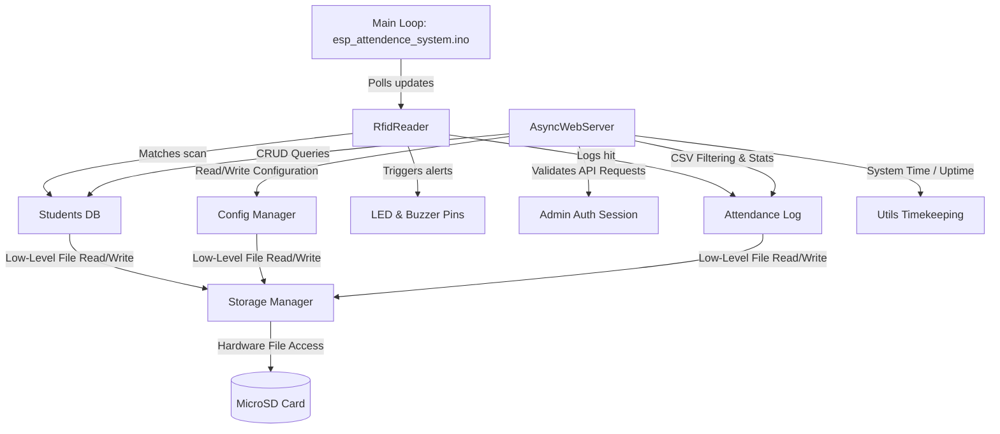

# Project: ESP32 RFID Attendance Management System (Offline, SD Card, Web Dashboard)

This project is a completely offline RFID-based Attendance Management System powered by an ESP32. It stores all student details and attendance logs directly on an SD card (using JSON and CSV formats) and hosts a responsive web dashboard accessible over the local Wi-Fi network.

## 1. Project Overview

* **Project Name**: ESP32 RFID Attendance Management System
* **Goal**: Provide a reliable, self-contained, and completely offline attendance tracking system with a local web dashboard, removing any dependency on external cloud services.
* **Features**:
  * RFID scanning (MFRC522) with configurable duplicate scan cooldown.
  * Offline data storage on MicroSD card (Students in JSON, Attendance in CSV, settings in JSON).
  * Auto-reconnecting Wi-Fi with Access Point (AP) fallback.
  * Local HTTP Web Server with a modern, responsive administrative dashboard.
  * REST API for CRUD operations on student records, fetching attendance logs, managing settings, and viewing dashboard status.
  * Admin authentication (login/session management).
  * System time synchronization via NTP (when online) or browser-sync API (when offline).
  * Audio/Visual feedback (Buzzer and LED indications) on successful/failed scans.
* **Hardware**:
  * ESP32 DevKit V1
  * RC522 RFID Reader
  * MicroSD Card Module (SPI)
  * LED (for status/scan feedback)
  * Buzzer (for acoustic feedback)
* **Software/Libraries**:
  * Arduino Framework (ESP32)
  * ESPAsyncWebServer & AsyncTCP (for Web Server and REST API)
  * ArduinoJson (for configuration and student database parsing)
  * MFRC522 (for RFID card reading)
  * SPI & SD (built-in libraries for SD card storage)

---

## 2. Folder Structure

```
esp_attendence_system/
├── platformio.ini           # PlatformIO configuration file
├── esp_attendence_system.ino # Main entry point (compatible with Arduino IDE)
├── config.h                 # Configuration declarations
├── config.cpp               # Configuration implementation (config.json management)
├── storage.h                # SD card file system manager declarations
├── storage.cpp              # SD card read/write JSON & CSV, backups, and status checks
├── wifi_manager.h           # Wi-Fi connection and AP fallback declarations
├── wifi_manager.cpp         # Wi-Fi connection and AP fallback implementation
├── rfid_reader.h            # RFID hardware driver & scanning logic declarations
├── rfid_reader.cpp          # RFID scanning, cooldown management, and buzzer/LED triggers
├── students.h               # Student database logic declarations
├── students.cpp             # In-memory student CRUD operations synced to students.json
├── attendance.h             # Attendance logging and reporting declarations
├── attendance.cpp           # Appending CSV records, report filtering, and exporting
├── webserver.h              # Async Web Server & REST API declarations
├── webserver.cpp            # REST API endpoints, routing, and HTML/CSS/JS page serving
├── web_pages.h              # Embedded HTML/CSS/JS frontend source strings (PROGMEM)
├── utils.h                  # Common utilities declarations
└── utils.cpp                # System uptime, date/time formatting, and timekeeping
```

---

## 3. Hardware Connections

Both the RC522 RFID Reader and the MicroSD Card Module utilize the SPI bus. On the ESP32 DevKit V1, the default hardware SPI pins are SCK (GPIO 18), MISO (GPIO 19), and MOSI (GPIO 23). They share these pins, while having separate Chip Select (CS / SS) pins.

### Wiring Table

| Component | Pin Name | ESP32 GPIO | Description |
| :--- | :--- | :--- | :--- |
| **Common SPI** | SCK | GPIO 18 | Shared Serial Clock |
| **Common SPI** | MISO | GPIO 19 | Shared Master In Slave Out |
| **Common SPI** | MOSI | GPIO 23 | Shared Master Out Slave In |
| **SD Card Module**| CS | GPIO 4 | SD Card Chip Select |
| **RC522 RFID** | SDA (SS) | GPIO 5 | RFID Chip Select |
| **RC522 RFID** | RST | GPIO 22 | RFID Reset Pin |
| **RC522 RFID** | IRQ | N/C | Not Connected |
| **Buzzer** | positive | GPIO 12 | Piezo buzzer control (via current-limiting resistor) |
| **Status LED** | anode (+) | GPIO 14 | LED visual feedback (via current-limiting resistor) |
| **All Modules** | VCC | 3.3V | RC522 & SD card modules *must* run on 3.3V to prevent ESP32 damage |
| **All Modules** | GND | GND | Shared Ground |

### GPIO Pin Selection Rationale
1. **SPI Pins (18, 19, 23)**: These are the hardware VSPI pins on the ESP32. Using hardware SPI ensures maximum speed and reliability when talking to both the high-frequency RFID reader and the SD card.
2. **SD Card CS (GPIO 4) & RC522 SS (GPIO 5)**: Standard general-purpose input/output (GPIO) pins used as Chip Selects to enable SPI communication with one device at a time.
3. **RC522 RST (GPIO 22)**: Used to perform a hardware reset on the RC522 RFID module.
4. **Buzzer (GPIO 12) & LED (GPIO 14)**: Non-conflicting GPIOs capable of outputting logic levels for audio/visual status signaling.

---

## 4. Software Architecture

The software is structured as a series of modular, decoupled components enclosed in namespaces. They communicate via clean static interfaces, preventing memory overhead or complex instances.



### Communication Workflows
1. **RFID Scanning Flow**: When a card is scanned, `RfidReader` reads the UID and queries `Students::getByUid()`. If found, it calls `Attendance::log()`. Depending on the status (Registered, Duplicate, Unknown), the feedback pins blink/beep, and the dashboard's last scan state variables are updated immediately.
2. **Web API Flow**: The client calls HTTP endpoints via the browser. `WebServerManager` intercepts requests, evaluates the `Authorization` header token, performs operations on `Students` or `Attendance`, and returns response objects formatted in JSON.
3. **Storage Sync Flow**: The memory-cached list of students (`Students`) ensures instantaneous lookup speeds. Any additions, updates, or deletions are written back to `students.json` automatically, maintaining storage consistency.

---

## 5. Feature Log

### Feature 1: Dynamic RFID Card Scanning
* **Purpose**: Capture RFID cards, inspect database registration, log present states, and provide local notifications.
* **Files**: [rfid_reader.h](file:///C:/Users/Tauhid/OneDrive%20-%20cse.pstu.ac.bd/Desktop/Personal%20Projects/ESP_Attendence_System/esp_attendence_system/rfid_reader.h), [rfid_reader.cpp](file:///C:/Users/Tauhid/OneDrive%20-%20cse.pstu.ac.bd/Desktop/Personal%20Projects/ESP_Attendence_System/esp_attendence_system/rfid_reader.cpp)
* **How it works**: Polls the MFRC522 card reader in a non-blocking loop. Translates card UID to an uppercase hex string. Compares it to the `cooldownList` (which retains scanned cards and automatically prunes entries older than `Config::cooldownS` seconds). If not in cooldown, it registers/denies the scan and triggers acoustic/visual feedback.
* **Design decisions**: Storing the duplicate scan list in RAM prevents repeated SD card writes which could cause wear on flash cells.

### Feature 2: High-Performance Offline Database
* **Purpose**: Maintain data files on the SD card using human-readable CSV and JSON formats.
* **Files**: [storage.h](file:///C:/Users/Tauhid/OneDrive%20-%20cse.pstu.ac.bd/Desktop/Personal Projects/ESP_Attendence_System/esp_attendence_system/storage.h), [storage.cpp](file:///C:/Users/Tauhid/OneDrive%20-%20cse.pstu.ac.bd/Desktop/Personal%20Projects/ESP_Attendence_System/esp_attendence_system/storage.cpp), [students.h](file:///C:/Users/Tauhid/OneDrive%20-%20cse.pstu.ac.bd/Desktop/Personal%20Projects/ESP_Attendence_System/esp_attendence_system/students.h), [students.cpp](file:///C:/Users/Tauhid/OneDrive%20-%20cse.pstu.ac.bd/Desktop/Personal%20Projects/ESP_Attendence_System/esp_attendence_system/students.cpp)
* **How it works**: Uses the ESP32's `SD` card driver library. Reads student lists into a `std::vector` of structures at boot, allowing lookup speeds in microseconds. Appends attendance entries directly to `attendance.csv` line-by-line without buffering the whole file, minimizing RAM overhead.
* **Design decisions**: Memory caching is used for students (where entries are small and read frequently) but *not* for attendance logs (where files can grow to megabytes). Attendance records are streamed line-by-line during filters/statistics calls.

### Feature 3: Auto-Fallback Network Connectivity
* **Purpose**: Enable network access to the web dashboard even in offline areas without routers.
* **Files**: [wifi_manager.h](file:///C:/Users/Tauhid/OneDrive%20-%20cse.pstu.ac.bd/Desktop/Personal%20Projects/ESP_Attendence_System/esp_attendence_system/wifi_manager.h), [wifi_manager.cpp](file:///C:/Users/Tauhid/OneDrive%20-%20cse.pstu.ac.bd/Desktop/Personal%20Projects/ESP_Attendence_System/esp_attendence_system/wifi_manager.cpp)
* **How it works**: Attempts connection to `wifiSSID` from configurations. If connection is not established within 15 seconds or if credentials are empty, it spins up an Access Point (AP) fallback using the local name of the device.

### Feature 4: Flexible Session Management (Quick Session + Scheduled Session)
* **Purpose**: Provide flexible classroom session handling via Quick Sessions (on-demand) and Calendar-based Scheduled Sessions.
* **Files**: [sessions.h](file:///C:/Users/Tauhid/OneDrive%20-%20cse.pstu.ac.bd/Desktop/Personal%20Projects/ESP_Attendence_System/esp_attendence_system/sessions.h), [sessions.cpp](file:///C:/Users/Tauhid/OneDrive%20-%20cse.pstu.ac.bd/Desktop/Personal%20Projects/ESP_Attendence_System/esp_attendence_system/sessions.cpp), [web_pages.h](file:///C:/Users/Tauhid/OneDrive%20-%20cse.pstu.ac.bd/Desktop/Personal%20Projects/ESP_Attendence_System/esp_attendence_system/web_pages.h)
* **How it works**:
  * **Quick Session**: Primary mode that removes fixed timetable assumptions. Admin/Teacher clicks "New Session", fills Subject (required), Teacher, Dept, Sem, Section, Room, Notes, and clicks "Start Session". Generates a unique Session ID, marks status "Active", records Start Time, sets RFID reader active subject, and streams live duration and present counts on the dashboard.
  * **Scheduled Sessions**: Supports creating class sessions for specific dates and times. If the current date/time matches a scheduled session, the system auto-starts it.
  * **End Session & Summary**: Clicking "End Session" records End Time, calculates duration, counts presents, sets status "Ended", and displays a completion summary popup.
  * **Storage**: Persisted to `/sessions.json` on the SD card.

### Feature 5: Administrative SPA Dashboard
* **Purpose**: Serve a rich dashboard showing statistics, live session cards, scheduled classes, session history, logs, student registration controls, settings, and reports.
* **Files**: [webserver.h](file:///C:/Users/Tauhid/OneDrive%20-%20cse.pstu.ac.bd/Desktop/Personal%20Projects/ESP_Attendence_System/esp_attendence_system/webserver.h), [webserver.cpp](file:///C:/Users/Tauhid/OneDrive%20-%20cse.pstu.ac.bd/Desktop/Personal%20Projects/ESP_Attendence_System/esp_attendence_system/webserver.cpp), [web_pages.h](file:///C:/Users/Tauhid/OneDrive%20-%20cse.pstu.ac.bd/Desktop/Personal%20Projects/ESP_Attendence_System/esp_attendence_system/web_pages.h)
* **How it works**: Embeds HTML, styling, layout elements, and JavaScript assets as a string variable in flash storage (`PROGMEM`), avoiding SPIFFS overhead. It uses AJAX/Fetch APIs for dynamic screen updates.
* **Design decisions**: SPA (Single Page Application) design enables client-side routing, minimizing web asset exchanges and conserving ESP32 CPU cycles.

---

## 6. API Documentation

All REST APIs require a Bearer token in the `Authorization` header, except `/api/login` and requests with an explicit `?token=` parameter (for downloads).

### Auth Endpoints
* **`POST /api/login`**
  * **Payload**: `{"username": "admin", "password": "admin123"}`
  * **Response**: `{"status": "success", "token": "session_123456"}`
  * **Description**: Verifies administrator credentials and returns a secure session token.

### Session Endpoints
* **`GET /api/session`**
  * **Response**: `{"id": "SESS_1782372300_123", "subject": "Computer Networks", "teacher": "Dr. Alan", "dept": "CSE", "sem": "5th", "section": "A", "room": "Lab 3", "notes": "", "date": "2026-07-22", "startTime": "10:00:00", "startEpoch": 1782372300, "presentsCount": 15, "status": "Active"}`
  * **Description**: Gets currently active session details and present count, auto-triggering scheduled sessions if date/time match.

* **`GET /api/sessions`**
  * **Response**: Array of all session objects (active, scheduled, history).
  * **Description**: Lists all stored sessions from `sessions.json`.

* **`POST /api/session`**
  * **Payload (Quick Session)**: `{"subject": "Physics", "teacher": "Dr. Smith", "dept": "CSE", "sem": "1st", "section": "A", "room": "101", "notes": ""}`
  * **Payload (Scheduled Session)**: `{"subject": "Physics", "scheduledDate": "2026-07-22", "scheduledStartTime": "14:00", "scheduledEndTime": "15:30"}`
  * **Response**: `{"status": "success", "id": "SESS_1782372300_456", "subject": "Physics", "startTime": "14:00:00", "sessionStatus": "Active"}`
  * **Description**: Starts a Quick Session immediately or schedules a future calendar session.

* **`POST /api/session/end`**
  * **Response**: `{"status": "success", "id": "SESS_...", "subject": "Physics", "startTime": "14:00:00", "endTime": "15:00:00", "duration": "1h 0m", "presentsCount": 24, "dept": "CSE", "sem": "1st", "section": "A"}`
  * **Description**: Ends the active session, calculates final duration & present count, and returns summary data.

### Data Endpoints
* **`GET /api/dashboard`**
  * **Response**:
    ```json
    {
      "uptime": "0d 00:15:30",
      "studentsCount": 142,
      "todayAttendance": 12,
      "sdStatus": {"available": true, "totalBytes": 16106127360, "usedBytes": 1245184},
      "wifi": {"mode": "STA", "ssid": "HomeNet", "rssi": -62, "ip": "192.168.1.104"},
      "lastScan": {"uid": "A1B2C3D4", "name": "Hasan Ahmed", "time": "09:15:30", "status": "Success", "epoch": 1782372300},
      "systemTime": "2026-07-07 09:15:45",
      "epoch": 1782372305
    }
    ```
  * **Description**: Delivers aggregated system diagnoses, storage details, and latest scan information.

* **`GET /api/students`**
  * **Params**: `search` (Optional text string filter)
  * **Response**: `[{"uid": "A1B2C3D4", "name": "Hasan", "roll": "1001", "dept": "CSE", ...}]`

* **`POST /api/students`**
  * **Payload**: `{"uid": "A1B2C3D4", "name": "Hasan", "roll": "1001", "dept": "CSE", "sem": "5th", "session": "2022-2023"}`
  * **Response**: `{"status": "success"}`

* **`PUT /api/students/{uid}`**
  * **Payload**: `{"name": "Hasan Modified", "roll": "1001", ...}`
  * **Response**: `{"status": "success"}`

* **`DELETE /api/students/{uid}`**
  * **Response**: `{"status": "success"}`

* **`GET /api/attendance`**
  * **Params**: `search` (name/roll/uid filter), `date` (YYYY-MM-DD), `dept` (string), `sem` (string), `limit` (max records to return, defaults to 100)
  * **Response**: `[{"date": "2026-07-07", "time": "09:15:30", "uid": "A1B2C3D4", "name": "Hasan Ahmed", ...}]`

### Report Endpoints
* **`GET /api/reports/daily`**
  * **Params**: `date` (YYYY-MM-DD, defaults to today)
  * **Response**: `{"CSE": 10, "EEE": 5}`
  * **Description**: Returns present student count grouped by department.

* **`GET /api/reports/monthly`**
  * **Params**: `month` (YYYY-MM, defaults to current)
  * **Response**: `{"1001": {"name": "Hasan Ahmed", "days": 12}}`
  * **Description**: Returns list of student roll numbers with their respective attendance days count.

### System Endpoints
* **`GET /api/settings`**
  * **Response**: `{"deviceName": "ESP32-Attendance", "cooldownS": 30, "adminUser": "admin", "wifiSSID": "HomeNet"}`

* **`POST /api/settings`**
  * **Payload**: `{"wifiSSID": "NewSSID", "wifiPass": "NewPass", "cooldownS": 15}`
  * **Response**: `{"status": "success"}`

* **`POST /api/time`**
  * **Payload**: `{"epoch": 1782372300}`
  * **Response**: `{"status": "success"}`
  * **Description**: Syncs system clock manually when running offline.

* **`POST /api/backup`**
  * **Response**: `{"status": "success"}`
  * **Description**: Creates backup file copies `/backup_config.json` and `/backup_students.json` on the SD card.

* **`POST /api/restart`**
  * **Response**: `{"status": "restarting"}`
  * **Description**: Triggers hardware reboot.

* **`GET /attendance.csv`**
  * **Response**: Raw CSV download.
  * **Description**: Streams the raw attendance file directly from the SD card.

---

## 7. SD Card File Formats

### File: `config.json`
Stores core network configurations, admin usernames, passwords, and cooldown timers.
```json
{
  "wifiSSID": "MyWiFiNetwork",
  "wifiPass": "SuperSecretPassword",
  "cooldownS": 30,
  "deviceName": "ESP32-Attendance",
  "adminUser": "admin",
  "adminPass": "admin123"
}
```

### File: `students.json`
Stores the database of registered students.
```json
[
  {
    "uid": "A1B2C3D4",
    "name": "Jane Doe",
    "roll": "1001",
    "dept": "CSE",
    "sem": "5th",
    "sec": "A",
    "phone": "+1234567890",
    "email": "jane.doe@example.com"
  }
]
```

### File: `sessions.json`
Stores quick and scheduled classroom session records.
```json
[
  {
    "id": "SESS_1782372300_123",
    "date": "2026-07-22",
    "subject": "Computer Networks",
    "teacher": "Dr. Alan Smith",
    "dept": "CSE",
    "sem": "5th",
    "section": "A",
    "room": "Lab 3",
    "notes": "Chapter 4 Lab",
    "startEpoch": 1782372300,
    "startTime": "10:00:00",
    "endEpoch": 1782375900,
    "endTime": "11:00:00",
    "scheduledDate": "",
    "scheduledStartTime": "",
    "scheduledEndTime": "",
    "duration": "1h 0m",
    "presentsCount": 24,
    "status": "Ended"
  }
]
```

### File: `attendance.csv`
Attendance registry. Standard CSV layout.
```csv
Date,Time,UID,Name,Roll,Department,Semester,Status
2026-07-07,09:15:30,A1B2C3D4,Jane Doe,1001,CSE,5th,Present
```

---

## 8. Web Pages

* **Login Page**:
  * **Purpose**: Authenticates the administrator.
  * **Actions**: Checks username/password and receives token.
  * **APIs**: `POST /api/login`.
* **Dashboard Page**:
  * **Purpose**: Displays active session details, live duration timer, present counts, scheduled classes, session history, live RFID scans, and department stats.
  * **Actions**: Open New Session modal (Quick or Scheduled), End Active Session (with summary modal), view live scans, and view stats.
  * **APIs**: `GET /api/dashboard`, `GET /api/session`, `POST /api/session`, `POST /api/session/end`, `GET /api/sessions`, `POST /api/time`, `GET /api/reports/daily`.
* **Students Page**:
  * **Purpose**: Manages student database.
  * **Actions**: Register student, edit student details, delete student, and capture UIDs live from the RFID reader.
  * **APIs**: `GET /api/students`, `POST /api/students`, `PUT /api/students/{uid}`, `DELETE /api/students/{uid}`.
* **Attendance Page**:
  * **Purpose**: Logs browser view.
  * **Actions**: Filters by name, roll, date, department, and semester.
  * **APIs**: `GET /api/attendance`.
* **Reports Page**:
  * **Purpose**: Generates reports and exports data.
  * **Actions**: Generates daily reports, monthly reports, triggers backups, and downloads `attendance.csv`.
  * **APIs**: `GET /api/reports/daily`, `GET /api/reports/monthly`, `POST /api/backup`, `GET /attendance.csv`.
* **Settings Page**:
  * **Purpose**: Configures system parameters.
  * **Actions**: Saves settings and triggers a system restart.
  * **APIs**: `GET /api/settings`, `POST /api/settings`, `POST /api/restart`.

---

## 9. Libraries Used

1. **MFRC522 (by Miguel Balboa)**: Used to read card UIDs and communicate with the RC522 reader.
2. **ArduinoJson (by Benoit Blanchon)**: Used to parse and serialize JSON databases.
3. **ESPAsyncWebServer & AsyncTCP**: Chosen to handle multiple client requests asynchronously without blocking the main RFID loop.
4. **SPI & SD (Built-in)**: Used to read and write database files on the MicroSD card.

---

## 10. Development Timeline

* **Version 0.1**: Initial firmware layout, SPI sharing tests, and RFID scanner driver implementation.
* **Version 0.2**: Offline SD Card manager, JSON reads/writes, and CSV log appending.
* **Version 0.3**: Memory-cached student management system, backup file tasks, and utilities.
* **Version 0.4**: Auto-fallback Access Point Wi-Fi manager.
* **Version 0.5**: Admin Login, Token authentication, REST APIs, and embedded SPA dashboard serving.

---

## 11. Known Issues & Limitations
1. **SPI Speed Sharing**: Some low-quality SD card modules may block the SPI bus. If the RFID reader fails to read when the SD card is mounted, try using a 10K pull-up resistor on both CS lines.
2. **Offline Clock Drift**: The ESP32's internal RTC drifts by a few seconds per day. The dashboard automatically syncs with the browser time on admin login to keep it accurate.

---

## 12. Future Roadmap
* **Bluetooth Sync**: Add ESP32 BLE support to sync logs with an offline Android app.
* **MySQL/Firebase Sync**: Add cloud sync if a network connection is available.
* **Face Recognition / QR code**: Add QR code scan fallback support.

---

## 13. Step-by-Step Build Instructions

### Method A: PlatformIO IDE (Recommended)
1. Install [VS Code](https://code.visualstudio.com/) and the **PlatformIO IDE** extension.
2. Open the `esp_attendence_system` workspace folder. PlatformIO will automatically read `platformio.ini` and download the required libraries.
3. Format your MicroSD card to FAT32.
4. Copy the sample files `config.json`, `students.json`, and `attendance.csv` to the root directory of the SD Card.
5. Connect your ESP32 board via USB.
6. Click the **Upload** button (arrow icon in the bottom status bar) to build and flash the firmware.
7. Open the **Serial Monitor** (plug icon) at `115200` baud rate to view the IP Address.

### Method B: Arduino IDE
1. Open the [Arduino IDE](https://www.arduino.cc/en/software).
2. Go to **File > Preferences** and add the ESP32 board URL:
   `https://raw.githubusercontent.com/espressif/arduino-esp32/gh-pages/package_esp32_index.json`
3. Go to **Tools > Board > Boards Manager**, search for `esp32` by Espressif, and install it.
4. Install the following libraries from **Sketch > Include Library > Manage Libraries**:
   - `MFRC522` by Miguel Balboa
   - `ArduinoJson` by Benoit Blanchon
5. Download **AsyncTCP** and **ESPAsyncWebServer** as ZIP files from GitHub and add them via **Sketch > Include Library > Add .ZIP Library**:
   - [AsyncTCP](https://github.com/me-no-dev/AsyncTCP)
   - [ESPAsyncWebServer](https://github.com/me-no-dev/ESPAsyncWebServer)
6. Open `esp_attendence_system.ino` in the Arduino IDE. All files (`config.cpp`, `webserver.cpp`, etc.) will automatically open in adjacent tabs.
7. Connect your ESP32 board, select it under **Tools > Board > ESP32 Arduino > ESP32 Dev Module**, choose the correct Port, and click **Upload**.
